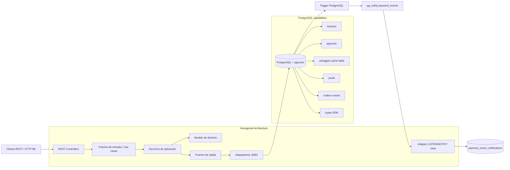
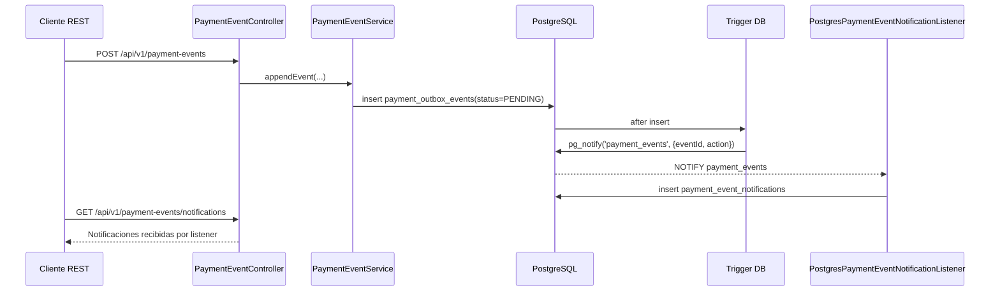

# PostgreSQL Multitypes

PoC que muestra el uso de los diferentes tipos de datos que se pueden usar en postgres:

| Capacidad PostgreSQL | Tabla principal dedicada | Caso de uso |
|---|---|---|
| `tsvector` | `payment_search_documents` | Búsqueda full-text de pagos, conciliaciones, canales y descripciones operativas. |
| `pgvector` | `payment_semantic_rules` | Búsqueda semántica de reglas de enrutamiento o decisión de pagos. |
| PostgreSQL como cache | `payment_cache_entries` | Cache temporal de decisiones de riesgo, tasas o datos de comercios. |
| `jsonb` | `payment_profiles` | Perfil flexible de comercio/cliente con atributos variables. |
| Eventos / Outbox + `LISTEN/NOTIFY` | `payment_outbox_events` | Persistencia transaccional de eventos de dominio y notificación asíncrona con PostgreSQL. |
| `bytea` | `payment_digital_certificates` | Almacenamiento de certificados o llaves públicas PEM de procesadores de pago. |

# Stack

- **Java 25**
- **Spring Boot 4.1.0** 
- **JDBC + JdbcTemplate**, porque permite usar capacidades nativas de PostgreSQL (`tsvector`, `vector`, `jsonb`, `bytea`, `LISTEN/NOTIFY`) sin forzar un ORM donde no aporta valor en la PoC.
- **Flyway como único mecanismo de schema + seed data**. No hay scripts duplicados de inicialización en Docker.
- **Eventos con patrón híbrido Outbox + `LISTEN/NOTIFY`**: el evento queda persistido en Outbox para durabilidad y `NOTIFY` despierta al microservicio cuando hay un nuevo evento o cambio de estado.

# Estructura del proyecto

```text
axiz-payment-processing-poc/
├── README.md
├── VALIDATION.md
├── pom.xml
├── datasets/
│   ├── flyway/
│   │   ├── V1__create_payment_processing_schema.sql
│   │   ├── V2__seed_payment_processing_data.sql
│   │   └── V3__add_payment_event_listen_notify.sql
│   ├── sample-payment-certificate.pem
│   └── sample-payment-profile.json
├── infraestructura/
│   ├── docker-compose.yml
│   └── http/
│       └── payment-processing-api.http
├── scripts/
│   └── maven-with-docker.sh
└── src/
    ├── main/
    │   ├── java/pe/axiz/paymentprocessing/
    │   │   ├── PaymentProcessingApplication.java
    │   │   ├── domain/
    │   │   │   ├── model/
    │   │   │   ├── port/in/
    │   │   │   ├── port/out/
    │   │   │   └── exception/
    │   │   ├── application/service/
    │   │   └── infrastructure/adapter/
    │   │       ├── in/rest/
    │   │       └── out/
    │   │           ├── messaging/
    │   │           └── persistence/
    │   └── resources/application.yml
    └── test/java/pe/axiz/paymentprocessing/application/service/
```

# Diagrama de arquitectura



# Flujo de eventos con Outbox + LISTEN/NOTIFY



# Estructura DDD + Hexagonal

## Dominio

Ubicación: `src/main/java/pe/axiz/paymentprocessing/domain`

Contiene el lenguaje del negocio y no depende de Spring:

- `SearchDocument`: documento operacional de pagos indexado con `tsvector`.
- `SemanticRule`: regla de ruteo/decisión con embedding en `pgvector`.
- `CacheEntry`: entrada temporal de cache basada en PostgreSQL.
- `PaymentProfile`: perfil flexible de comercio/cliente usando `jsonb`.
- `PaymentOutboxEvent`: evento de dominio persistido como outbox.
- `PaymentEventNotification`: notificación recibida desde PostgreSQL `LISTEN/NOTIFY`.
- `DigitalCertificate`: certificado/llave pública PEM almacenado como `bytea`.


## Servicios de aplicación

Ubicación: `application/service`

Implementan los casos de uso, validaciones de aplicación y coordinación con los puertos de salida:

- `PaymentSearchService`
- `SemanticRoutingService`
- `PaymentCacheService`
- `PaymentProfileService`
- `PaymentEventService`
- `DigitalCertificateService`
- `DeterministicEmbeddingService`

`DeterministicEmbeddingService` crea embeddings determinísticos de 6 dimensiones con SHA-256. En producción, este componente se reemplazaría por un modelo real o servicio de embeddings, manteniendo intacto el puerto/repositorio.

## Adaptadores de salida PostgreSQL

Ubicación: `infrastructure/adapter/out/persistence`

Implementan los repositorios con `JdbcTemplate` y SQL nativo para aprovechar funcionalidades específicas de PostgreSQL.

## Adaptador de mensajería PostgreSQL

Ubicación: `infrastructure/adapter/out/messaging`

`PostgresPaymentEventNotificationListener` mantiene una conexión dedicada a PostgreSQL y ejecuta:

```sql
LISTEN payment_events;
```

Cuando recibe un `NOTIFY`, parsea el payload mínimo `{eventId, action}`, consulta el evento durable en `payment_outbox_events` y guarda la evidencia completa en `payment_event_notifications`.

# Infraestructura mínima

La carpeta `infraestructura` contiene solo lo necesario para probar el concepto:

```text
infraestructura/
├── docker-compose.yml
└── http/payment-processing-api.http
```

La precarga se ejecuta automáticamente con Flyway al iniciar el microservicio:

- `V1__create_payment_processing_schema.sql`: crea extensión `vector`, tablas e índices base.
- `V2__seed_payment_processing_data.sql`: inserta datos demo para las seis funcionalidades.
- `V3__add_payment_event_listen_notify.sql`: crea tabla de auditoría de notificaciones, función PL/pgSQL, trigger y `pg_notify('payment_events', ...)`.

En `pom.xml`, la carpeta `datasets/flyway` se copia al classpath como `db/migration`, por eso Spring Boot/Flyway la detecta sin duplicar scripts.

# Cómo levantar la base de datos

Desde la raíz del proyecto:

```bash
cd infraestructura
docker compose up -d
```

Conectarse manualmente:

```bash
docker exec -it axiz-payment-postgres psql -U axiz -d axiz_payments
```

# Cómo compilar

Con Maven local y JDK 25:

```bash
mvn clean verify
```

Luego ejecutar la aplicación:

```bash
mvn spring-boot:run
```

O con Docker para Maven/JDK:

```bash
./scripts/maven-with-docker.sh spring-boot:run
```

Variables soportadas:

| Variable | Default |
|---|---|
| `DB_URL` | `jdbc:postgresql://localhost:5432/axiz_payments` |
| `DB_USERNAME` | `axiz` |
| `DB_PASSWORD` | `axiz_secret` |
| `SERVER_PORT` | `8080` |
| `PAYMENT_EVENTS_LISTEN_NOTIFY_ENABLED` | `true` |
| `PAYMENT_EVENTS_LISTEN_NOTIFY_CHANNEL` | `payment_events` |
| `PAYMENT_EVENTS_LISTEN_NOTIFY_POLL_TIMEOUT_MILLIS` | `1000` |
| `PAYMENT_EVENTS_LISTEN_NOTIFY_RECONNECT_DELAY_MILLIS` | `2000` |

# Endpoints en orden de ejecución recomendado

| Orden | Capacidad | Método | Endpoint | Descripción funcional | Descripción técnica |
|---:|---|---|---|---|---|
| 1 | `tsvector` | `POST` | `/api/v1/payment-search-documents` | Registra un documento operacional de pago para búsqueda. | Inserta en `payment_search_documents`; la columna `search_vector` se calcula automáticamente como `tsvector`. |
| 2 | `tsvector` | `GET` | `/api/v1/payment-search-documents?query=pago qr comercio` | Busca pagos o conciliaciones por texto. | Usa `websearch_to_tsquery('spanish', ?)` y ranking con `ts_rank_cd`. |
| 3 | `pgvector` | `POST` | `/api/v1/payment-semantic-rules` | Registra una regla de ruteo semántico. | Genera embedding determinístico de 6 dimensiones e inserta en columna `vector(6)`. |
| 4 | `pgvector` | `GET` | `/api/v1/payment-semantic-rules/nearest?text=pagos tarjeta&limit=3` | Encuentra reglas parecidas al texto enviado. | Usa operador de distancia coseno `<=>` sobre `pgvector`. |
| 5 | Cache | `PUT` | `/api/v1/payment-cache/{cacheKey}` | Guarda una decisión temporal de riesgo/tasa/comercio. | Hace upsert en tabla `UNLOGGED payment_cache_entries` con TTL. |
| 6 | Cache | `GET` | `/api/v1/payment-cache/{cacheKey}` | Consulta una entrada temporal. | Lee por PK y valida expiración por `expires_at`. |
| 7 | Cache | `DELETE` | `/api/v1/payment-cache/expired` | Elimina entradas vencidas. | Ejecuta limpieza física de registros expirados. |
| 8 | `jsonb` | `POST` | `/api/v1/payment-profiles` | Registra perfil flexible de comercio/cliente. | Inserta `attributes` como `jsonb`. |
| 9 | `jsonb` | `GET` | `/api/v1/payment-profiles?attributeName=riskLevel&value=LOW` | Busca perfiles por atributo variable. | Consulta `attributes ->> ? = ?` e índice GIN para consultas JSONB. |
| 10 | Eventos | `POST` | `/api/v1/payment-events` | Registra un evento de dominio de pagos. | Inserta en `payment_outbox_events`; el trigger ejecuta `pg_notify('payment_events', '{eventId, action}')`. |
| 11 | Eventos | `GET` | `/api/v1/payment-events?status=PENDING` | Lista eventos pendientes de publicación. | Filtra por estado e índice `(status, created_at)`. |
| 12 | Eventos | `GET` | `/api/v1/payment-events/notifications?limit=20` | Lista notificaciones PostgreSQL recibidas por el listener Java. | Consulta `payment_event_notifications`, tabla alimentada por `PostgresPaymentEventNotificationListener`. |
| 13 | Eventos | `PATCH` | `/api/v1/payment-events/{id}/published` | Marca un evento como publicado. | Actualiza `status='PUBLISHED'`, `published_at=now()` y vuelve a disparar `NOTIFY` por cambio de estado. |
| 14 | `bytea` | `POST` | `/api/v1/payment-certificates` | Guarda certificado/llave PEM de procesador. | Decodifica Base64 y persiste bytes en `bytea`; calcula fingerprint SHA-256. |
| 15 | `bytea` | `GET` | `/api/v1/payment-certificates` | Lista metadatos de certificados. | Retorna alias, owner, algoritmo, fingerprint y tamaño. |
| 16 | `bytea` | `GET` | `/api/v1/payment-certificates/{alias}?includePem=true` | Consulta certificado por alias. | Lee `bytea` y opcionalmente retorna PEM como texto. |

# Request/Response rápido

También puedes usar `infraestructura/http/payment-processing-api.http` desde IntelliJ IDEA, VS 
Code REST Client o cualquier cliente compatible.

## 1. Insertar documento `tsvector`

Request:

```http
POST /api/v1/payment-search-documents
Content-Type: application/json

{
  "paymentReference": "PAY-QR-9001",
  "channel": "QR",
  "description": "Pago QR aprobado para comercio veterinaria con liquidación inmediata"
}
```

Response esperado:

```json
{
  "id": "uuid",
  "paymentReference": "PAY-QR-9001",
  "channel": "QR",
  "description": "Pago QR aprobado para comercio veterinaria con liquidación inmediata",
  "createdAt": "2026-07-09T..."
}
```

## 2. Buscar con `tsvector`

```http
GET /api/v1/payment-search-documents?query=pago qr comercio
```

Resultado: lista de documentos más relevantes según ranking full-text.

## 3. Insertar regla `pgvector`

```http
POST /api/v1/payment-semantic-rules
Content-Type: application/json

{
  "ruleCode": "ROUTE-CARD-LOW-RISK",
  "title": "Ruta tarjeta bajo riesgo",
  "description": "Procesar pagos con tarjeta de bajo monto usando adquirente principal y autorización inmediata"
}
```

Resultado: regla creada con embedding determinístico.

## 4. Buscar reglas cercanas con `pgvector`

```http
GET /api/v1/payment-semantic-rules/nearest?text=pagos con tarjeta de monto bajo&limit=3
```

Resultado: lista ordenada por menor distancia semántica.

## 5. Insertar cache

```http
PUT /api/v1/payment-cache/merchant-risk:MRC-2001
Content-Type: application/json

{
  "ttlSeconds": 3600,
  "value": {
    "merchantId": "MRC-2001",
    "riskLevel": "LOW",
    "decision": "ALLOW"
  }
}
```

## 6. Consultar cache

```http
GET /api/v1/payment-cache/merchant-risk:MRC-2001
```

## 7. Insertar perfil `jsonb`

```http
POST /api/v1/payment-profiles
Content-Type: application/json

{
  "profileCode": "PROFILE-MERCHANT-NEW",
  "documentNumber": "20445566778",
  "attributes": {
    "customerSegment": "SME",
    "merchantCategory": "retail",
    "riskLevel": "MEDIUM",
    "settlementMode": "T1"
  }
}
```

## 8. Consultar perfil `jsonb`

```http
GET /api/v1/payment-profiles?attributeName=riskLevel&value=LOW
```

## 9. Crear evento Outbox y disparar `NOTIFY`

```http
POST /api/v1/payment-events
Content-Type: application/json

{
  "aggregateId": "PAY-QR-9001",
  "eventType": "PaymentAuthorized",
  "payload": {
    "paymentReference": "PAY-QR-9001",
    "amount": 150.90,
    "currency": "PEN",
    "channel": "QR"
  }
}
```

Qué ocurre internamente:

1. El endpoint inserta el evento en `payment_outbox_events` con estado `PENDING`.
2. El trigger `trg_notify_payment_outbox_event` ejecuta `pg_notify('payment_events', '{eventId, action}')`. 
No envía todo el evento para evitar el límite de tamaño de `NOTIFY`.
3. `PostgresPaymentEventNotificationListener` recibe el `NOTIFY` mediante `LISTEN payment_events`, 
consulta el evento por `eventId` en Outbox y reconstruye la notificación completa.
4. El listener guarda la evidencia en `payment_event_notifications`.

## 10. Consultar eventos Outbox

```http
GET /api/v1/payment-events?status=PENDING
```

## 11. Consultar notificaciones recibidas por `LISTEN/NOTIFY`

```http
GET /api/v1/payment-events/notifications?limit=20
```

Response esperado:

```json
[
  {
    "id": "uuid",
    "eventId": "uuid-del-evento-outbox",
    "channel": "payment_events",
    "action": "EVENT_APPENDED",
    "aggregateId": "PAY-QR-9001",
    "eventType": "PaymentAuthorized",
    "status": "PENDING",
    "payload": {
      "paymentReference": "PAY-QR-9001",
      "amount": 150.9,
      "currency": "PEN",
      "channel": "QR"
    },
    "receivedAt": "2026-07-09T..."
  }
]
```

## 12. Marcar evento como publicado y disparar otro `NOTIFY`

```http
PATCH /api/v1/payment-events/{id}/published
```

El trigger envía otra notificación con:

```json
{
  "action": "EVENT_STATUS_CHANGED",
  "status": "PUBLISHED"
}
```

## 13. Guardar certificado PEM en `bytea`

```http
POST /api/v1/payment-certificates
Content-Type: application/json

{
  "alias": "processor-secondary-public-key",
  "owner": "Secondary Payment Processor",
  "algorithm": "RSA",
  "base64Pem": "LS0tLS1CRUdJTiBQVUJMSUMgS0VZLS0tLS0KTUZ3d0RRWUpLb1pJaHZjTkFRRUJCUUFEU3dBd1NBSkJBTHYybkRlbW9Pbmx5Rm9yQXhpelBvY05vdFJlYWxLZXkKOVFJREFRQUIKLS0tLS1FTkQgUFVCTElDIEtFWS0tLS0tCg=="
}
```

# Consultas SQL útiles

Revisar documentos full-text:

```sql
select payment_reference, channel, description, search_vector
from payment_search_documents;
```

Revisar embeddings:

```sql
select rule_code, embedding
from payment_semantic_rules;
```

Revisar cache:

```sql
select cache_key, cache_value, expires_at
from payment_cache_entries;
```

Revisar perfiles JSONB:

```sql
select profile_code, attributes
from payment_profiles
where attributes ->> 'riskLevel' = 'LOW';
```

Revisar eventos Outbox:

```sql
select id, aggregate_id, event_type, status, payload
from payment_outbox_events
order by created_at desc;
```

Revisar notificaciones recibidas por el listener:

```sql
select event_id, channel, action, aggregate_id, event_type, status, received_at
from payment_event_notifications
order by received_at desc;
```

Probar `LISTEN/NOTIFY` manualmente en `psql`:

```sql
LISTEN payment_events;
```

En otra sesión, insertar un evento:

```sql
insert into payment_outbox_events (id, aggregate_id, event_type, payload, status, created_at)
values ('66666666-6666-6666-6666-666666666661', 'PAY-MANUAL-0001', 'PaymentAuthorized', '{"amount":10,"currency":"PEN"}'::jsonb, 'PENDING', now())
on conflict (id) do nothing;
```

Revisar certificados:

```sql
select alias, owner, algorithm, fingerprint_sha256, octet_length(pem_content) as size_bytes
from payment_digital_certificates;
```
